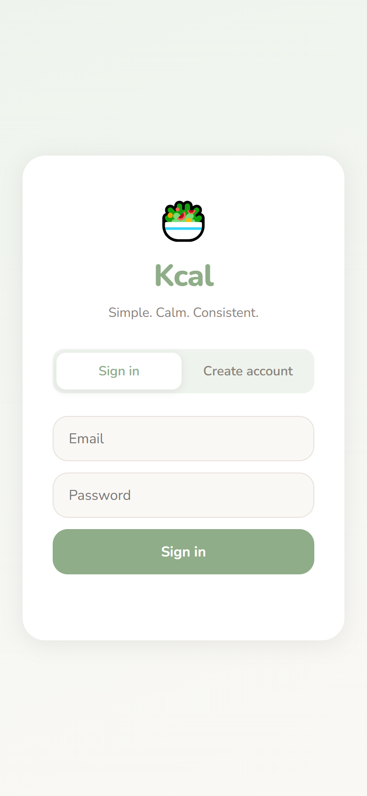
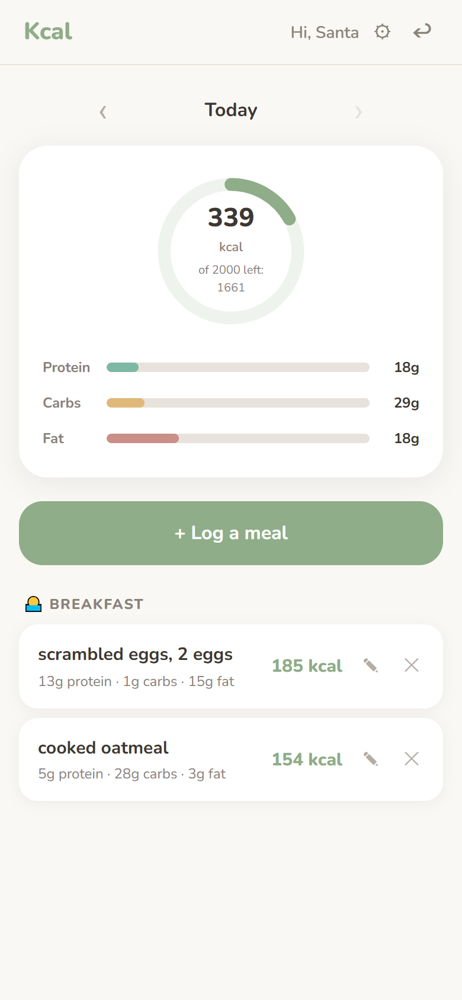
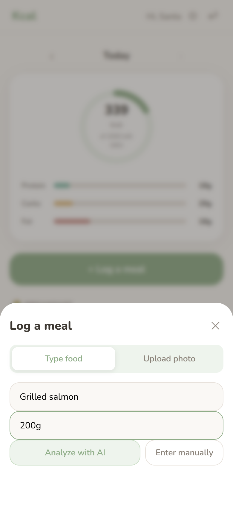

# Kcal — AI-Powered Calorie & Macro Tracker

A calm, mobile-first nutrition tracker that uses AI to analyze your meals from text or photos. Built with Node.js, SQLite, and the Anthropic Claude API.

<p align="center">
  
  &nbsp;&nbsp;
  
  &nbsp;&nbsp;
  
</p>

---

## Features

- **AI food analysis** — type any food (e.g. "2 eggs", "1 cup oatmeal", "large slice of pizza") and Claude estimates calories, protein, carbs, and fat instantly
- **Photo upload** — snap a photo of your meal and Claude Vision identifies it and returns macros
- **Flexible units** — grams, cups, tablespoons, pieces, slices — whatever makes sense to you
- **Manual entry fallback** — AI not working? Enter values yourself with one tap
- **Daily calorie ring** — animated SVG ring fills as you log throughout the day
- **Macro progress bars** — smooth animated bars for protein, carbs, and fat
- **Meal editing** — tap the pencil icon on any logged meal to update it
- **Date navigation** — browse and edit any past day
- **Streak counter** — tracks consecutive days you hit your calorie goal
- **Custom daily targets** — set your own calorie and macro goals
- **Meal grouping** — cards organized by breakfast, lunch, dinner, and snack

---

## Tech Stack

| Layer | Technology |
|---|---|
| Frontend | HTML, CSS, Vanilla JavaScript |
| Backend | Node.js, Express |
| Database | SQLite (via Node.js built-in `node:sqlite`) |
| AI | Anthropic Claude API (`claude-sonnet-4-20250514`) |
| Auth | JWT + bcrypt |

---

## Getting Started

### Prerequisites

- Node.js v22 or later
- An [Anthropic API key](https://console.anthropic.com/)

### 1. Clone the repo

```bash
git clone https://github.com/sandyandoss/kcal.git
cd kcal
```

### 2. Install backend dependencies

```bash
cd backend
npm install
```

### 3. Configure environment

```bash
cp .env.example .env
```

Edit `.env`:

```
PORT=3001
JWT_SECRET=your_long_random_secret_here
ANTHROPIC_API_KEY=sk-ant-...
```

### 4. Start the backend

```bash
node --no-warnings src/index.js
```

### 5. Serve the frontend

```bash
cd ../frontend
python -m http.server 5500
```

Open **http://localhost:5500** in your browser.

---

## API Reference

| Method | Endpoint | Description |
|---|---|---|
| `POST` | `/auth/register` | Create account |
| `POST` | `/auth/login` | Sign in, returns JWT |
| `GET` | `/meals?date=YYYY-MM-DD` | List meals for a day |
| `POST` | `/meals` | Log a new meal |
| `PUT` | `/meals/:id` | Edit an existing meal |
| `DELETE` | `/meals/:id` | Remove a meal |
| `GET` | `/summary?date=YYYY-MM-DD` | Daily totals + streak |
| `GET` | `/targets` | Get macro goals |
| `PUT` | `/targets` | Update macro goals |
| `POST` | `/analyze/text` | AI macro estimate by food name + amount |
| `POST` | `/analyze/photo` | AI macro estimate from image upload |

---

## Project Structure

```
kcal/
├── backend/
│   ├── src/
│   │   ├── db/
│   │   │   ├── schema.sql        # Table definitions
│   │   │   └── database.js       # SQLite connection
│   │   ├── middleware/
│   │   │   └── auth.js           # JWT verification
│   │   ├── routes/
│   │   │   ├── auth.js           # Register & login
│   │   │   ├── meals.js          # Meal CRUD + streak updates
│   │   │   ├── targets.js        # Daily macro goals
│   │   │   ├── summary.js        # Daily summary endpoint
│   │   │   └── analyze.js        # Anthropic AI integration
│   │   └── index.js              # Express entry point
│   ├── .env.example
│   └── package.json
└── frontend/
    ├── index.html
    ├── css/
    │   └── styles.css            # Design system + components
    ├── js/
    │   ├── api.js                # Fetch wrapper for all API calls
    │   ├── auth.js               # Login/register/session logic
    │   ├── dashboard.js          # Ring + bar animations
    │   ├── meals.js              # Meal card rendering
    │   └── app.js                # Main app logic + modals
    └── assets/                   # Screenshots
```

---

## Design Decisions

**Why `node:sqlite` instead of `better-sqlite3`?**
Node.js v22+ ships with a built-in SQLite module. No native compilation, no platform-specific binaries, zero extra dependencies.

**Why Vanilla JS?**
The app is simple enough that a framework would add complexity without benefit. Module pattern keeps state encapsulated and the code readable.

**Why in-memory image handling?**
Photos are sent directly from the user's device to the Anthropic API in one request — no disk writes, no storage costs, no privacy concerns.

**AI rate limiting**
Photo analysis is capped at 5 requests per user per day to keep API costs predictable on a small Anthropic plan.

---

## License

MIT
